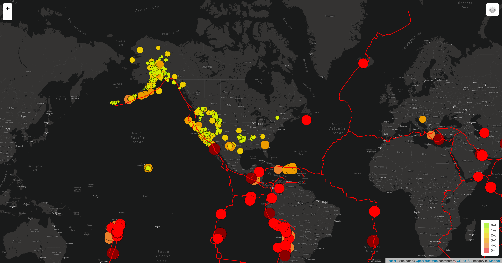

# Mapping Earthquakes

## Project Overview

After creating a map with with two different maps and an earthquake overlay, Basil and Sadhana would like tectonic plate data and 4.5+ magnitude earthquake data displayed onto the map. They would also like a third map style added to the overall map.

## Resources

- Software: Visual Studio Code 1.68.1
- Languages: JavaScript, CSS, HTML

## Example Image

